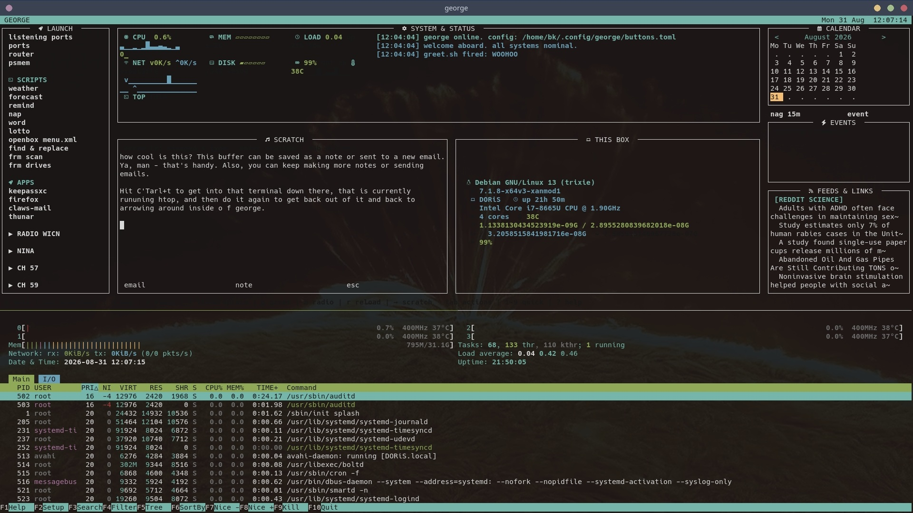

# george

TUI sort of a "control center" for your Debian desktop because why the hell not. One python process (stdlib + urwid only,
~30 MB RAM, ~0% idle CPU) that opens fullscreen at X login and gives you:

- **LAUNCH** column — config-driven buttons that launch whatever is on your
  `$PATH` (your own scripts, apps, system tools). Configure in `buttons.toml`
  (a portable demo ships; copy it and point `GEORGE_CONFIG` at your own copy
  to keep your personal button set out of the repo). Press `r` to reload.
- **SYSTEM & STATUS** center — live CPU / MEM / LOAD / NET / DISK / BATT /
  TEMP panes read straight from `/proc` + sysfs every 2 s (left of the
  block) beside the scrolling status log (right). Arrow onto a pane and
  press enter to open the matching tool (iotop, iftop, ncdu, btop...) in a
  new terminal; mapping is in `[click]` of `buttons.toml`. Keyboard-first:
  mouse input is disabled, arrows + enter drive everything.
- **SHOWCASE + THIS BOX** lower center — left block is a wicked handy scratch
  space that you can save as a note or send off as an email, and, you may keep
  doing it (`[showcase]` lines in `buttons.toml`); right block is a
  fastfetch-style **THIS BOX** readout (PC, OS + kernel + uptime, WM + GTK
  theme + package count, init, date, load, processes, memory, partitions) —
  all built from george's own `/proc` + `/sys` + `/etc` reads, **zero
  subprocesses**, same numbers fastfetch would show. The channels themselves
  are plain **launcher buttons** in
  the LAUNCH column: **CH 57** plays random public-domain *Leave It to Beaver*
  episodes, **CH 59** a silent-comedy/cartoons/oddball-docs lineup
  (`[tv]` / `[funny]` in `buttons.toml`; the lineup maps are in
  `tv/*.m3u`, regenerate with `tools/mktv.py` / `tools/update-funny.py`).
  Each chip opens mpv in **its own separate window** (shuffled, looping,
  tiled ~60% top-right so george stays visible behind it — `f` fullscreens
  it if you want) —
  alt-tab back to george whenever, close the mpv window to stop. No docked or
  embedded video, no focus tricks, nothing for george to babysit. Listen, I
  know this is weird, but, random Leave it to Beaver episodes is hilarious so
  it's in and it's staying. The george window itself starts undecorated if
  you give openbox a rule for it (`<application class="georges"><decor>no</decor>
  </application>` in `~/.config/openbox/rc.xml`).
- **Built-in terminal** — one alacritty window is split by tmux into two
  panes: george on top, a real shell below (`bin/george` does this; Ctrl+t,
  wired as a tmux no-prefix binding, flips focus between them, or click a
  pane). The terminal pane runs your shell in a loop, so Ctrl+D or `exit`
  just gives a fresh prompt — it can never take george down. Enter the
  terminal with Ctrl+t or a click; come back to the dashboard the same way.
  Run `bin/george` from a bare console tty (no X/wayland) and it falls back
  to running the dashboard directly in the terminal — george is a pure urwid
  TUI, so it works on a plain console too (no tmux pane there, just the
  dashboard). `term:` buttons work on the console as well: george drops its
  UI, each script opens on a fresh screen, and the output stays put with an
  `exit $rc | q closes` footer until you press q — Ctrl+c instead kills a
  long-running script and its reader and returns you to the dashboard
  (george itself is shielded). `gui:` buttons still need X, naturally.
- **Random Nina chip** (`[nina]` in `buttons.toml`) — one-audio rule: starts
  by freezing the radio (SIGSTOP, so it resumes where it left off), then
  streams the whole shuffled Nina Simone archive pool (208 songs + 2 whole
  albums, looping) until the chip is hit again — not a one-track stop. The
  picker answers `--playlist` with a fresh shuffled playlist; the repo ships
  `cmd = "nina.sh"` as an example. Standalone `nina.sh` (outside george) also
  toggles: run it again to stop, no need to find the window for `q`.
- **Top bar** — clock plus a chip per running/minimized window (via wmctrl).
  Display-only since going keyboard-first; alt-tab / your WM's keys manage
  windows as always.
- **Right column** — month calendar with today boxed (`<`/`>` page months),
  `nag 15m` button (your `nag` script), event form (light-surface modal,
  focus starts on the date field) writing to
  `~/.local/share/george/events.txt`; due events fire a critical
  notify-send plus a terminal bell, then move to `events.fired.log`;
  upcoming list, and up to 12 RSS/link slots (stdlib parser, cached under
  `~/.cache/george/`, refreshed every 15 min).
- **find & replace** (`f`) — literal or regex replacement across a directory
  tree with dry-run preview, hit counts, glob filter, binary/git skip, and
  `*.bak-fr` originals kept.

## Run

    bin/george            # opens its own terminal, class "georges"
    # or, once installed on your PATH:
    george

Keys: `1-9` quick-launch, `n` nag, `e` event, `f` find&replace, `g` greet,
`r` reload config, `?` help, `esc` hide (alt-tab to raise), `q` quit. CH
57/59 launch mpv in their own window (close it / alt-tab back); the built-in
terminal is the tmux pane below — Ctrl+t or click to enter/leave, Ctrl+D in
it only spawns a fresh prompt.

Term buttons hold their window open after the command exits (exit code +
"enter closes"). Per-item `hold = false` in `buttons.toml` restores
close-on-exit.

## Configuration

Config resolution, in order of preference:

1. `$GEORGE_CONFIG` — if set, used verbatim.
2. `~/.config/george/buttons.toml` — your personal copy, if it exists.
3. `buttons.toml` in this repo — the portable demo with common on-PATH
   commands, used only when you have no personal config yet.

So the demo ships and works out of the box, but as soon as you create a
personal config at `~/.config/george/buttons.toml` george uses that instead
(keeping your button set out of any public fork). To make your own:

    mkdir -p ~/.config/george
    cp buttons.toml ~/.config/george/buttons.toml

Press `r` inside george to reload after editing either file.

## Install at login (WM-agnostic)

Add to your X-session startup (e.g. `~/.xinitrc`), adapting the path to
wherever you cloned george:

    if ! pgrep -u "$USER" -f '/george\.py' >/dev/null 2>&1; then
        (sleep 5 && /path/to/george/bin/george) &
    fi

george maximizes itself at startup via wmctrl (EWMH), so no window-manager
config is touched. Works under any EWMH-compliant WM.

## Self test

    python3 george.py --self-test

Covers cpu/net math, wmctrl parsing, calendar grid, RSS+Atom parsing, the
full find&replace engine against a scratch tree, event round-trips.

Requires: python3-urwid (Python ≥ 3.11 for stdlib `tomllib`); on X: alacritty,
wmctrl, xdotool, xprop (x11-utils), and `tmux` (for the built-in terminal
panes — Ctrl+t flips focus; already present on most Debian installs). On a
bare console tty none of those are needed — `bin/george` just runs the
dashboard directly. The
CH 57/59 buttons additionally need `mpv`. Nothing else — the embedded-video
helper is long gone; channels are plain launcher buttons.
