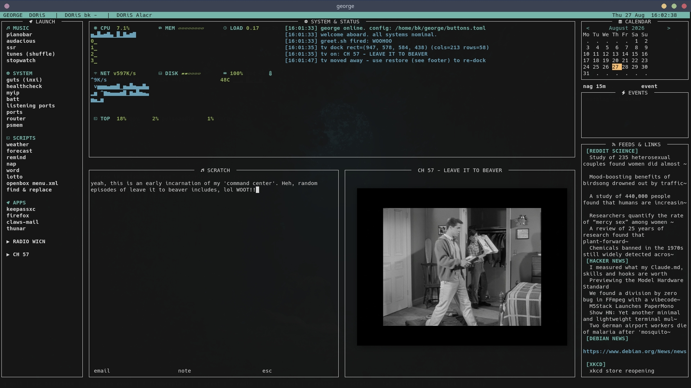

# george

TUI sort of a "control center" for your Debian desktop because why the hell not. One python process (stdlib + urwid only,
~30 MB RAM, ~0% idle CPU) that opens fullscreen at X login and gives you:

- **LAUNCH** column — config-driven buttons that launch whatever is on your
  `$PATH` (your own scripts, apps, system tools). Configure in `buttons.toml`
  (a portable demo ships; copy it and point `GEORGE_CONFIG` at your own copy
  to keep your personal button set out of the repo). Press `r` to reload.
- **SYSTEM & STATUS** center — live CPU / MEM / LOAD / NET / DISK / BATT /
  TEMP panes read straight from `/proc` + sysfs every 2 s (left of the
  block) beside the scrolling status log (right). Arrow onto a pane and
  press enter to open the matching tool (iotop, iftop, ncdu, btop...) in a
  new terminal; mapping is in `[click]` of `buttons.toml`. Keyboard-first:
  mouse input is disabled, arrows + enter drive everything.
- **SHOWCASE + TV** lower center — left block is a wicked handy scratch space that you can save as a note or send off as an email, and, you may keep doing it.
  (`[showcase]` lines in `buttons.toml`); right block is the video channel: george plays
  random public-domain *Leave It to Beaver* episodes streamed from archive.org
  directly **inside** the block (`[tv]` in `buttons.toml`; regenerate lineup
  with `tools/mktv.py`). It is genuinely embedded, not docked: `george-vidwin`
  (ships in this repo) keeps one X connection that owns a WM-invisible
  window, and mpv renders into it with `--wid`. Because the window is
  invisible to the window manager it can never grab keyboard focus, so your
  keys stay in george the whole time — arrows, `space` to pause/resume,
  `q` to stop (a second `q` quits george). You can click the video too:
  left- or right-click pauses. The overlay follows george's resizes and
  hides under its dialogs, and dies with george. And there's a **CH 59** — a
  silent-comedy/cartoons/oddball-docs channel (`[funny]` in `buttons.toml`,
  regenerate with `tools/update-funny.py`) that shares the same one video
  slot: starting one stops the other, like flipping channels. The same box
  is also a **windowless terminal** (`[term]` in `buttons.toml`): an
  undecorated alacritty pinned exactly to the block, no frame, no alt-tab
  entry. A channel switch buries the terminal; stopping a channel (`q` /
  the chip again) brings it back quietly. What's in the slot at login is
  `[boot] autostart` — `"term"` (default, focused workspace), `"tv"`,
  `"funny"`, or `"none"`. Listen, I know this is
  weird, but, random Leave it to Beaver episodes is hilarious so it's in
  and it's staying.
- **Random Nina chip** (`[nina]` in `buttons.toml`) — same one-audio rule as
  the radio: starts by freezing tv + radio (SIGSTOP, so they resume where
  they left off), then streams the whole shuffled Nina Simone archive pool
  (208 songs + 2 whole albums, looping) until the chip is hit again — not a
  one-track stop. The picker answers `--playlist` with a fresh shuffled
  playlist; the repo ships `cmd = "nina.sh"` as an example. Standalone
  `nina.sh` (outside george) also toggles: run it again to stop, no need to
  find the window for `q`.
- **Top bar** — clock plus a chip per running/minimized window (via wmctrl).
  Display-only since going keyboard-first; alt-tab / your WM's keys manage
  windows as always.
- **Right column** — month calendar with today boxed (`<`/`>` page months),
  `nag 15m` button (your `nag` script), event form (light-surface modal,
  focus starts on the date field) writing to
  `~/.local/share/george/events.txt`; due events fire a critical
  notify-send plus a terminal bell, then move to `events.fired.log`;
  upcoming list, and up to 12 RSS/link slots (stdlib parser, cached under
  `~/.cache/george/`, refreshed every 15 min).
- **find & replace** (`f`) — literal or regex replacement across a directory
  tree with dry-run preview, hit counts, glob filter, binary/git skip, and
  `*.bak-fr` originals kept.

## Run

    bin/george            # opens its own terminal, class "georges"
    # or, once installed on your PATH:
    george

Keys: `1-9` quick-launch, `n` nag, `e` event, `f` find&replace, `g` greet,
`r` reload config, `?` help, `esc` hide (alt-tab to raise), `q` quit.
While the TV is playing, `space` pauses/resumes it and `q` stops it
instead of quitting george.

Term buttons hold their window open after the command exits (exit code +
"enter closes"). Per-item `hold = false` in `buttons.toml` restores
close-on-exit.

## Configuration

Config resolution, in order of preference:

1. `$GEORGE_CONFIG` — if set, used verbatim.
2. `~/.config/george/buttons.toml` — your personal copy, if it exists.
3. `buttons.toml` in this repo — the portable demo with common on-PATH
   commands, used only when you have no personal config yet.

So the demo ships and works out of the box, but as soon as you create a
personal config at `~/.config/george/buttons.toml` george uses that instead
(keeping your button set out of any public fork). To make your own:

    mkdir -p ~/.config/george
    cp buttons.toml ~/.config/george/buttons.toml

Press `r` inside george to reload after editing either file.

## Install at login (WM-agnostic)

Add to your X-session startup (e.g. `~/.xinitrc`), adapting the path to
wherever you cloned george:

    if ! pgrep -u "$USER" -f '/george\.py' >/dev/null 2>&1; then
        (sleep 5 && /path/to/george/bin/george) &
    fi

george maximizes itself at startup via wmctrl (EWMH), so no window-manager
config is touched. Works under any EWMH-compliant WM.

## Self test

    python3 george.py --self-test

Covers cpu/net math, wmctrl parsing, calendar grid, RSS+Atom parsing, the
full find&replace engine against a scratch tree, event round-trips.

Requires: python3-urwid (Python ≥ 3.11 for stdlib `tomllib`), alacritty,
wmctrl, xdotool, xprop (x11-utils). TV block additionally needs `mpv` and
**`python3-xlib`** — the embedded-video helper `george-vidwin` (ships in
this repo) talks X11 directly, so users without it need to install it first:

    sudo apt install python3-xlib

(The helper resolves itself from `~/bin/george-vidwin`, this repo, or your
`$PATH`, in that order — george tells you if it can't find it.)

Layout note: the CH 57 video is an embedded overlay hugging the
lower-right of george — the demo config traces a block so its exact size
depends on terminal rows; tune `[tv] x/y/w/h` in config if the overlay
doesn't line up with your window size.
